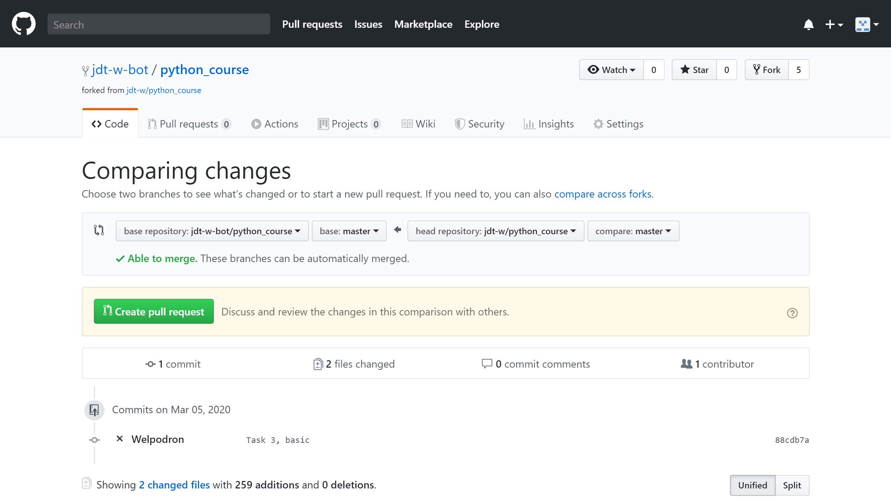
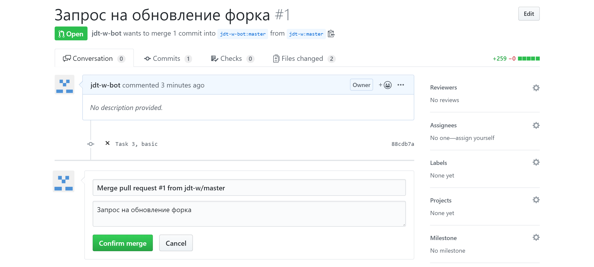
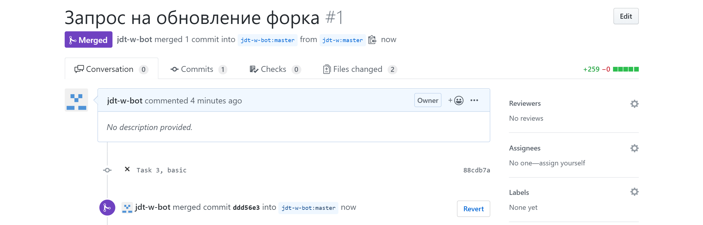

# Раздел 1 Обучение программированию на Python

### Задание 3: Начало рабочего процесса часть 1

#### 1. Виды заданий:

На курсе предусмотрены два типа заданий: 

* Задания для самостоятельной работы 
* Задания для работы с github

Задания для самостоятельной работы не проверяются. При выполнении данной категории заданий, вы проверяете себя самостоятельно. 

Задания для работы с github предусматривают выполнение задание, с последующей отправкой в мастер-репозиторий. Все задания данной категории проверяются.

В дальнейшем файлы `README.md` в папках заданий не будут содержать следующие пункты: `2. Процесс получения заданий:`, 
`3. Задания для самостоятельной работы:`, `4. Задания для работы с github`, `5. Выполнение заданий, связанных с работой на github`, `5.1 Выполнение заданий, связанных с работой на github (онлайн)` 

То есть файл `README.md` в папках заданий будет содержать лишь текст заданий (как для самостоятельной так и для работы с хабом) и дополнительные материалы, поэтому при необходимости, если вы забыли о том как осуществляется работа на проекте, то вы всегда можете открыть файлы `README.md` первых трёх заданий (папки: `Задание 1`, `Задание 2`, `Task 3`)

#### 2. Процесс получения заданий:

Все задания формируются [согласно регламенту курса](https://github.com/jdt-w/python_course/blob/master/README.md)

Для получения задания из мастер-репозитория, а также для получения всех ресурсов, загруженных на github (из мастер репозитория) необходимо выполнить следующее: (при условии, что вы выполнили `Задание 1` и `Задание 2`) (для выполнения данных действий с телефона или в режиме онлайн, используйте описание раздела `5.1 Выполнение заданий, связанных с работой на github (онлайн)`, пункт `Получение заданий:`): 

* [Перейдите по данной ссылке](https://github.com/jdt-w/python_course/pulls) и выберете пункт `New pull request`:


* В открывшемся окне выберете пункт `compare across forks`: 


* В появившейся таблице выберете раздел `base repository: jdt-w/python_course` и измените его значение на ваш скопированный (форк) репозиторий: (например в моём случае, это `jdt-w-bot/python_course` (у вас будет: `ВАШ_НИКНЕЙМ_НА_GITHUB/python_course`)):


* В результате появится следующее окно, в котором нажимаем на кнопку `Create pull request`: (Обратите внимание, что сейчас вы находитесь в вашем форке (сверху есть надпись `forked from jdt-w/python_course`)):



* Меняем заголовок запроса (при необходимости) (я, например, изменил заголовок на: `Запрос на обновление форка`) и снова нажимаем кнопку `Create pull request`:


* Обновляем страницу браузера, и нажимаем кнопку `Merge pull request`:


* Подтверждаем, что мы точно хотим осуществить запрос, нажатием на кнопку `Confirm merge`:



* Если вы всё сделали правильно, и на githube не возникло ошибок при слиянии репозиториев, у вас появится следующее: 



* В случае, если ошибок не возникло, открываем github desktop и нажимаем кнопку `Fetch origin`:


* Если не возникло ошибок, нажимаем кнопку `Pull origin`:


* Готово, ваш локальный репозиторий готов к работе 

**Почему так?** 

Дело в том, что выбранная мной работа с хабом (одна из схем работы, существуют и другие) осуществляется следующим образом:


**Для любознательных**

В следующих разделах курса, мы автоматизируем данный процесс и перейдём постепенно с github dekstop на консольную систему контроля версий: `git` 

#### 3. Задания для самостоятельной работы:

Теория, которая необходима для успешной сдачи курса, а также задания для самостоятельной работы доступны в режиме онлайн на сайте [pythontutor.ru](http://pythontutor.ru/). 

#### 4. Задания для работы с github 

Теоретические материалы, а также задания данного раздела составляются для получения необходимых основных принципов работы с git, а также с python. 

#### 5. Выполнение заданий, связанных с работой на github 

Для выполнения заданий данной категории нет необходимости работать локально, используя vs code, а также github desktop.
Все задания можно выполнять в режиме онлайн на самом github **(Подробнее в пункте `5.1 Выполнение заданий, связанных с работой на github (онлайн)`)**

При выполнении каждого задания соблюдайте следующий регламент: 

* 1. **Проверяйте мастер репозиторий и ваш локальный, а также форк на различия перед каждым заданием** ваш локальный репозиторий и форк должны полностью быть аналогичными мастер репозиторию, если они отличаются осуществите запросы на обновление 

* 2. **Если ваши репозитории различаются с мастер репозиторием** осуществите запросы на обновление

* 3. **В папке с заданием** (теперь папки с заданием будут иметь имя в формате `Task НОМЕР_ЗАДАНИЯ` - в следующем разделе курса, мы подробно разберём почему в названии папок должен использоваться латинский алфавит) **всегда** (кроме случаев, если вы не можете работать локально) создавайте свою папку, имеющую название, соответствующее вашему никнейму на github (например, в моём случае, папка будет всегда иметь название `welpodron`) 

* 4. **В созданной вами папке** создавайте файл(ы), использующие **латинский** алфавит 

* 5. **Всегда после проделанной вами работы отправляйте запросы на мастер репозиторий** как осуществить данные запросы описано в `Задании 2`

#### 6. Задание 3: Основы Python часть 1

В данном задании будут рассмотрены базовые концепции работы с переменными в Python: 

**Теория для выполнения заданий: (доступно после регистрации на сайте (смотри пункт `3. Задания для самостоятельной работы:`))**

* [Занятие 1. Ввод и вывод данных](http://pythontutor.ru/lessons/inout_and_arithmetic_operations/) 
* [Занятие 2. Условия: 4. Тип данных bool](http://pythontutor.ru/lessons/ifelse/#section_4) 
* [Занятие 3. Вычисления: 2. Действительные числа](http://pythontutor.ru/lessons/int_and_float/#section_2)
* [Занятие 5. Строки](http://pythontutor.ru/lessons/str/)
* [Занятие 7. Списки](http://pythontutor.ru/lessons/lists/)
* [Занятие 10. Множества](http://pythontutor.ru/lessons/sets/)
* [Занятие 11. Словари](http://pythontutor.ru/lessons/dicts/)

**Дополнительные материалы:**

* [Учебник](http://wombat.org.ua/AByteOfPython/AByteofPythonRussian-2.01.pdf)
    * Глава 7 Основы 
    * Глава 12 Структуры данных:
        * 12.1 Список
        * 12.3 Кортеж
        * 12.4 Словарь
        * 12.5 Последовательности
        * 12.6 Множество

**Задания для самостоятельной работы: (доступно после регистрации на сайте (смотри пункт `3. Задания для самостоятельной работы:`))** 

* [Занятие 1. Ввод и вывод данных Задача «Сумма трёх чисел»](http://pythontutor.ru/lessons/inout_and_arithmetic_operations/problems/aplusbplusc/) 
* [Занятие 1. Ввод и вывод данных Задача «Площадь прямоугольного треугольника»](http://pythontutor.ru/lessons/inout_and_arithmetic_operations/problems/rect_triangle_square/)  
* [Занятие 1. Ввод и вывод данных Задача «Электронные часы»](http://pythontutor.ru/lessons/inout_and_arithmetic_operations/problems/electronic_watch/)
* [Занятие 1. Ввод и вывод данных Задача «Hello, Harry!»](http://pythontutor.ru/lessons/inout_and_arithmetic_operations/problems/hello_harry/)
* [Занятие 1. Ввод и вывод данных Задача «Следующее и предыдущее»](http://pythontutor.ru/lessons/inout_and_arithmetic_operations/problems/next_and_previous/)
* [Занятие 5. Строки Задача «Делаем срезы»](http://pythontutor.ru/lessons/str/problems/slices/)
* [Занятие 5. Строки Задача «Количество слов»](http://pythontutor.ru/lessons/str/problems/num_words/)
* [Занятие 5. Строки Задача «Переставить два слова»](http://pythontutor.ru/lessons/str/problems/swap_two_words/)    
* [Занятие 5. Строки Задача «Удаление символа»](http://pythontutor.ru/lessons/str/problems/delete_char/)

**Задания для работы с github:**

* Получите обновления с мастер репозитория при необходимости 

* Выполнение задания 3:

Согласно регламенту пункта `5. Выполнение заданий, связанных с работой на github` в созданном вами файле(файлах), необходимо выполнить следующее задание:

* Создайте переменную типа `int` (число), присвойте ей любое значение, соответствующее значениям переменных такого типа и выведете в консоль используя функцию `print()` значение данной переменной и её тип, используя функцию `type()`, в качестве аргумента функции `print()` (множественные аргументы, которые передаются в функцию, отделяются запятыми): 

```python
# Пример кода: 
number_example = 1
print(number_example, type(number_example)) # 1 <class 'int'>
```

* Аналогично создайте переменную типа `str` (строку) и выведете в консоль такую же информацию, используя `print()` и `type()`
* Создайте переменную типа `list` (список, "массив", "лист") и заполните его как вам угодно, последним элементом списка обязательно сделайте созданную на первом пункте переменную типа `int` и выведете в консоль такую же информацию, используя `print()` и `type()` (например, исходя из кода выше, последним элементом словаря будет `number_example`)

**ПРИМЕЧАНИЕ:** на курсе Python мы будем больше всего работать со списками и словарями, в других языках программирования, например в C++, аналогом списка является динамический массив, который мог бы хранить в себе любые типы данных (также C++ имеет и std контейнер list, который тоже похож на списки в python), ОДНАКО Python имеет библиотеку которая создаёт именно МАССИВЫ, а не списки (в них ограничен тип принимаемых данных), но работать с ними на данном курсе мы НЕ будем и поэтому, чтобы было легче считайте (**но только на курсе**), что **СПИСОК ЭТО ТОЖЕ САМОЕ ЧТО И ЛИСТ И ТОЖЕ САМОЕ ЧТО И МАССИВ, ТЕ КОГДА ВЫ СЛЫШИТЕ СОЗДАЁМ МАССИВ ИЛИ ЛИСТ ИЛИ СПИСОК В PYTHON ЭТО ОЗНАЧАЕТ ЧТО МЫ СОЗДАЁМ _СПИСОК_ ИМЕЮЩИЙ ТИП `list`**

* Создайте переменную типа `dict` (словарь), первому ключу словаря (название и тип ключа, выбираете самостоятельно) присвойте значение переменной `int` созданной в первом пункте задания (например, исходя из кода выше, значением данного ключа будет `number_example`), второму ключу словаря (название и тип ключа, выбираете самостоятельно) присвойте значение переменной `str`, созданной во втором пункте, третьему ключу словаря (название и тип ключа, выбираете самостоятельно) присвойте значение переменной `list`, созданной в третьем пункте, четвёртый ключ словаря должен соответствовать следующей конструкции (_переменная `int` созданная в первом пункте_ **:** _переменная `int`, созданная в первом пункте_) (например, исходя из кода выше: `number_example : number_example`) (обратите особое внимание на этот пункт), пятый ключ словаря должен быть `переменная `int` созданная в первом пункте + 1` и иметь значение `'magic is here'`, последний пункт словаря имеет ключ `3` и значение ключа - пустой словарь типа `dict`, выведете информацию о созданном словаре используя `print()` и `type()` 

* Увеличьте значение переменной `int`, созданной в первом пункте на `1`

**НЕ НУЖНО возвращаться сюда**:

```python
# Пример кода: 
number_example = 1
print(number_example, type(number_example)) # 1 <class 'int'>
```

и делать так: 

```python
# Пример кода: 
number_example = 1+1 #или number_example = 2
print(number_example, type(number_example)) # 1 <class 'int'>
```

выполните операцию увеличения как **отдельную операцию** с **уже созданной переменной**, например как бы выглядел правильный код:

```python
# Пример кода: 
number_example = 1 
print(number_example, type(number_example)) # 1 <class 'int'>

number_example += 1 
```

* Выведете в консоль новое значение переменной `int`

* Выведете в консоль переменные типа `list` и `dict`, обратите внимание, что при изменении значение переменной `int`, значения в `list` и `dict` не изменились 

* Добавьте к уже существующей строке `str` (в конец строки) используя функцию `str()` новое значение переменной `int`, выведете новое значение строки в консоль 

* После проверки того, что ваша программа работает без ошибок сохраните изменения и создайте пул реквест (также, как вы делали в предыдущих заданиях, если вы забыли как это делается посмотрите ещё раз `Задание 2`)

**Примечания:**

* (Образец решённого задания содержится в папке: `welpodron`)

#### 5.1 Выполнение заданий, связанных с работой на github (онлайн)

При невозможности работать локально, вы можете использовать уже готовые решения, предложенные платформой. Для работы с Github в режиме онлайн на курсе предусмотрено несколько вариантов реализации выполнения заданий, я рассмотрю вариант, работы с телефона (с компьютера, вы также можете использовать данный метод):

Первым пунктом, нам необходимо получить от мастер-репозитория самую последнюю версию проекта (при условии что вы выполнили первые два задания): 

**Получение заданий:**

* Открываем на github [мастер-репозиторий, раздел пул реквестов](https://github.com/jdt-w/python_course/pulls):
* Нажимаем кнопку кнопку `New`


* На открывшейся странице выбираем `compare across forks`


* В результате у нас появится новая табличка

* В пункте `base repository: jdt-w/python_course` выбираем наш скопированный репозиторий: (например в моём случае, это `jdt-w-bot/python_course` (у вас будет: `ВАШ_НИКНЕЙМ_НА_GITHUB/python_course`))

* Нажимаем на кнопку `Create pull request`:


* Меняем заголовок запроса (при необходимости) (я, например, изменил заголовок на: `Запрос на обновление`) и снова нажимаем кнопку `Create pull request`:


* Обновляем страницу браузера, и нажимаем кнопку `Merge pull request`:


* Подтверждаем, что мы точно хотим осуществить запрос, нажатием на кнопку `Confirm merge`:


* Если вы всё сделали правильно, и на githube не возникло ошибок при слиянии репозиториев, у вас появится следующее изображение: 


* Готово, ваш скопированный репозиторий (форк), готов к работе 

**Выполнение заданий:**

* Заходим в наш форк и нажимаем `View code`

* Заходим в папку нужного нам задания и переходим на десктопную версию

* Нажимаем кнопку `Create new file`

* Убедитесь что вы находитесь в нужной сейчас папке `python_course/ПАПКА_С_ЗАДАНИЕМ/`

* В поле `Name your file...` вводим `ВАШ_НИКНЕЙМ_НА_ХАБЕ.py` (`.py` - это не ру русскими буквами это две английские буквы p и y)

* В поле `Enter file contents here` вбиваете ваш python код 

* Листаете вниз и нажимаете на кнопку `Commit new file`

* Открываем на github [мастер-репозиторий, раздел пул реквестов](https://github.com/jdt-w/python_course/pulls)
* Нажимаем кнопку кнопку `New`
* На открывшейся странице выбираем `compare across forks`
* ВНИМАНИЕ: В пункте **`head repository: jdt-w/python_course`** выбираем наш форк: (например в моём случае, это `jdt-w-bot/python_course` (у вас будет: `ВАШ_НИКНЕЙМ_НА_GITHUB/python_course`))
* Нажимаем на кнопку `Create pull request`
* Заполняем при необходимости `Title` и снова нажимаем `Create pull request` 
* Готово, запрос на проверку задания отправлен 